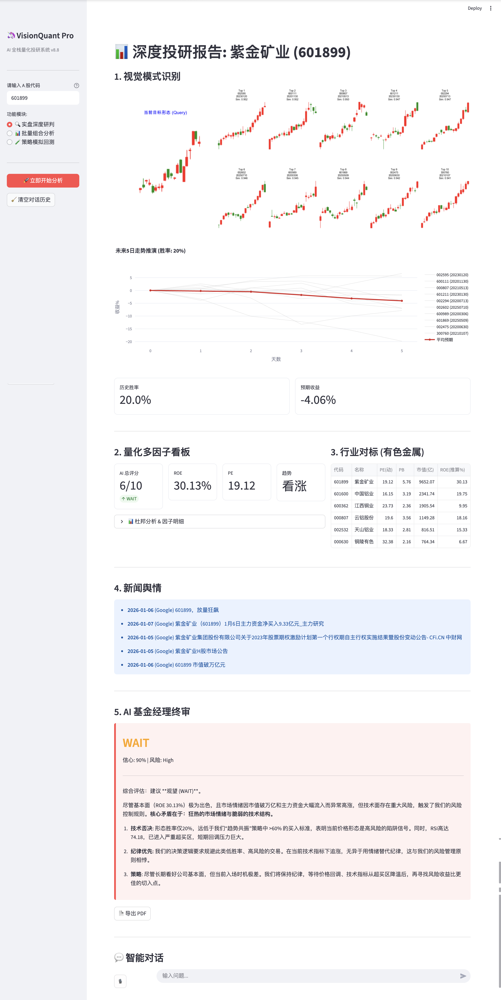
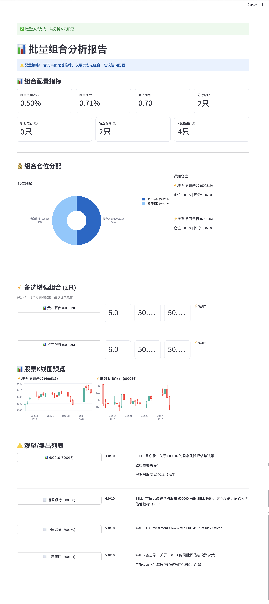
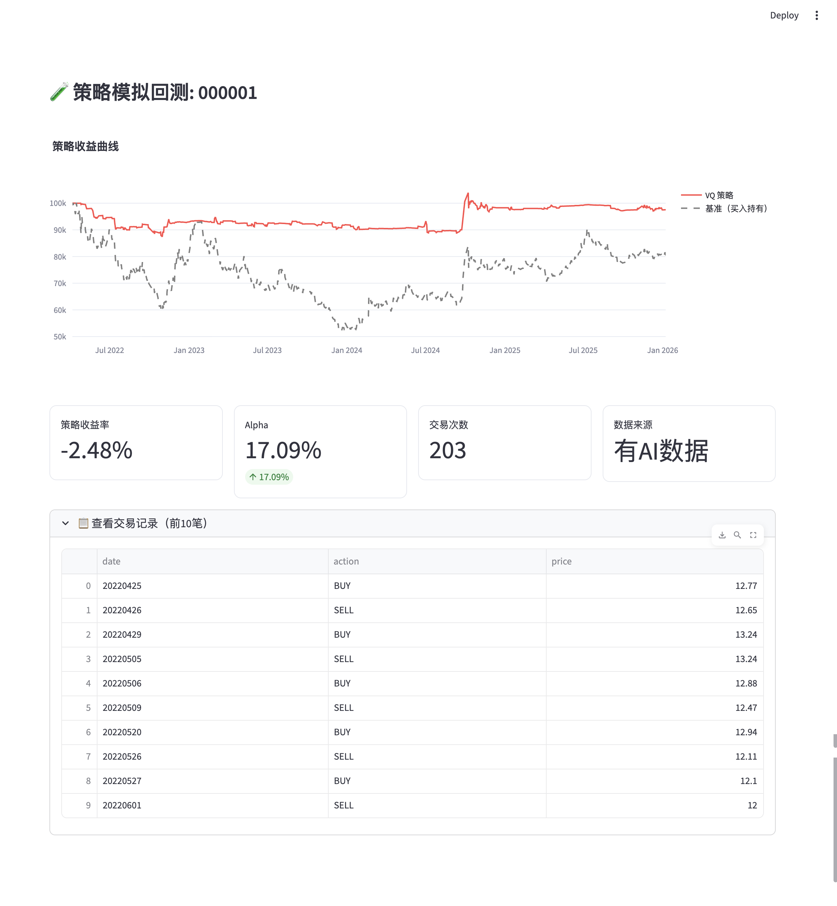
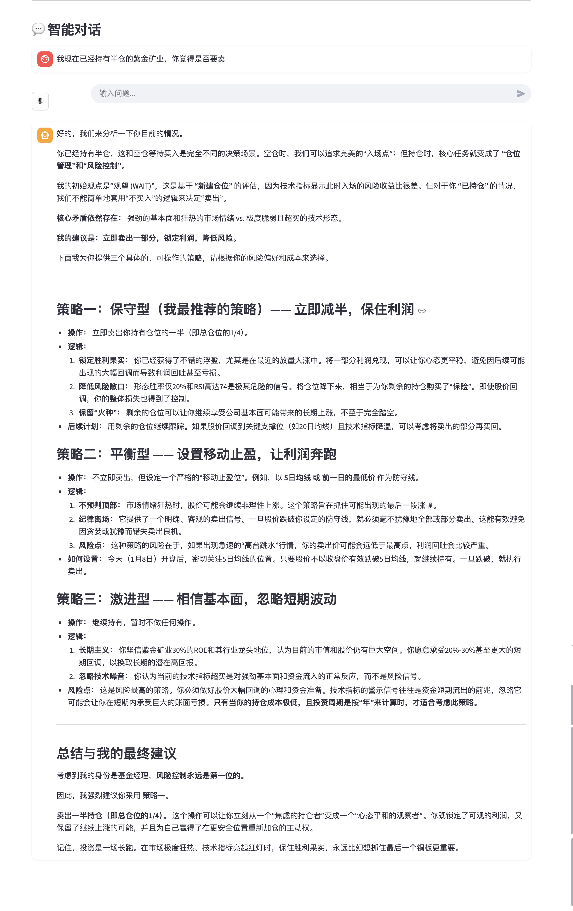

# VisionQuant-Pro

<div align="center">

**Vision-Based Quantitative Trading System with Deep Learning**

[](https://www.python.org/)
[](https://pytorch.org/)
[](https://streamlit.io/)
[](LICENSE)
[](https://github.com/panyisheng095-ux/VisionQuant-Pro/stargazers)

**[📖 Technical Report](docs/papers/VisionQuant-Pro_Technical_Report.pdf)** | 
**[💬 Discussions](https://github.com/panyisheng095-ux/VisionQuant-Pro/discussions)** |
**[🐛 Issues](https://github.com/panyisheng095-ux/VisionQuant-Pro/issues)**

</div>

---

## Overview

VisionQuant-Pro is an enterprise-grade quantitative trading system that leverages **deep learning** and **computer vision** to analyze candlestick chart patterns for stock market prediction. The system employs a self-attention enhanced Convolutional Autoencoder (AttentionCAE) to extract visual features from K-line charts, combined with FAISS-based similarity search to identify historically similar patterns and predict future returns.

### Key Innovations

- **Attention-Enhanced CAE**: Multi-head self-attention mechanism captures long-range dependencies in chart patterns (e.g., Head-and-Shoulders formations)
- **Hybrid Similarity Search**: Combines visual feature similarity (70%) with price series correlation (30%) for robust pattern matching
- **Multi-Factor Scoring**: Integrates visual patterns (V), fundamental analysis (F), and technical indicators (Q) into a unified 10-point scoring system
- **Markowitz Portfolio Optimization**: Dynamic portfolio allocation with risk-adjusted returns maximization
- **Adaptive Trading Strategy**: Dual-mode strategy that adjusts AI weights based on market regimes (bull/bear)

---

## Architecture

```
┌─────────────────────────────────────────────────────────────┐
│                    VisionQuant-Pro System                    │
├─────────────────────────────────────────────────────────────┤
│                                                             │
│  ┌──────────────┐    ┌──────────────┐    ┌──────────────┐  │
│  │  Data Layer  │───▶│ Model Layer │───▶│Strategy Layer│  │
│  │              │    │              │    │              │  │
│  │ • Stock Data │    │ • AttentionCAE│   │ • Multi-Factor│  │
│  │ • K-line Img│    │ • VisionEngine│   │ • Portfolio   │  │
│  │ • FAISS Index│    │ • PredictEng │   │ • Backtester  │  │
│  └──────────────┘    └──────────────┘    └──────────────┘  │
│         │                   │                   │           │
│         └───────────────────┴───────────────────┘           │
│                            │                                 │
│                   ┌────────▼────────┐                        │
│                   │  Web Interface  │                        │
│                   │   (Streamlit)   │                        │
│                   └─────────────────┘                        │
│                                                             │
└─────────────────────────────────────────────────────────────┘
```

### Core Components

1. **AttentionCAE Model**: 8-head self-attention enhanced convolutional autoencoder
   - Encoder: 4-layer CNN (3→32→64→128→256 channels)
   - Attention: Multi-head self-attention (8 heads, 256 dims)
   - Decoder: 4-layer transpose CNN
   - Output: 1024-dimensional feature vectors

2. **VisionEngine**: FAISS-based similarity search engine
   - Index: 400,000+ historical candlestick patterns
   - Search: Millisecond-level Top-K retrieval
   - Time Isolation: NMS algorithm prevents overlapping patterns

3. **Multi-Factor Scoring System**:
   - Visual Score (V): 0-3 points based on predicted win rate
   - Fundamental Score (F): 0-4 points (ROE, PE ratio)
   - Quantitative Score (Q): 0-3 points (MA60, RSI, MACD)
   - Total: 0-10 points → BUY (≥7) / WAIT (5-6) / SELL (<5)

4. **Portfolio Optimizer**: Markowitz mean-variance optimization
   - Objective: Maximize Sharpe ratio
   - Constraints: Position limits (5%-20%), max 10 positions
   - Expected returns: Estimated from historical similar patterns

---

## Features

### 🎯 Visual Pattern Recognition
- **Deep Learning Feature Extraction**: AttentionCAE automatically learns morphological features from 224×224 RGB candlestick images
- **Historical Pattern Matching**: FAISS vector database enables millisecond-level retrieval of 400,000+ historical patterns
- **Win Rate Prediction**: Statistical analysis of similar historical patterns to predict future price movements

### 📊 Intelligent Analysis System
- **Multi-Factor Integration**: Combines visual patterns, fundamental analysis, and technical indicators
- **Batch Portfolio Analysis**: Parallel analysis of 30+ stocks with automatic portfolio optimization
- **Industry Comparison**: Automatic peer analysis with industry-specific metrics

### 🤖 AI-Powered Decision Making
- **LangChain Integration**: Google Gemini-based intelligent investment advisor
- **Context-Aware Analysis**: Understands analysis results and provides personalized recommendations
- **Natural Language Interface**: Interactive chat for investment queries

### 📈 Strategy Backtesting
- **VQ Strategy**: Adaptive vision-quant strategy with dynamic position sizing
- **Comprehensive Metrics**: Alpha, Sharpe ratio, maximum drawdown, win rate
- **Time-Series Analysis**: Full backtesting on 2022-2025 historical data

---

## Quick Start

### Prerequisites

- Python 3.9+
- PyTorch 2.0+ (with MPS/CUDA support recommended)
- 8GB+ RAM
- 10GB+ disk space for data

### Installation

```bash
# Clone the repository
git clone https://github.com/panyisheng095-ux/VisionQuant-Pro.git
cd VisionQuant-Pro

# Create virtual environment
python -m venv venv
source venv/bin/activate  # Linux/Mac
# venv\Scripts\activate  # Windows

# Install dependencies
pip install -r requirements.txt
```

### Configuration

```bash
# Optional: Configure API key for AI chat (create .env file)
echo "GOOGLE_API_KEY=your_api_key_here" > .env
```

### Data Preparation

```bash
# Download sample data and create directory structure
python scripts/prepare_data.py
```

**Note**: The full dataset (154GB) is not included in the repository. Sample data includes 5 stocks for quick testing. For full functionality, you need to:
1. Train the AttentionCAE model: `python scripts/train_attention_cae.py`
2. Rebuild the FAISS index: `python scripts/rebuild_index_attention.py`

### Launch Web Interface

```bash
# Recommended: Use the launcher script (handles Python path automatically)
python run.py

# Alternative: Direct Streamlit launch
PYTHONPATH=. streamlit run web/app.py
```

Visit: http://localhost:8501

---

## Usage Examples

### Single Stock Analysis

```python
# In the Web interface, enter stock code
symbol = "600519"  # Kweichow Moutai

# System returns:
# - Top 10 similar historical patterns (with similarity scores)
# - Multi-factor scorecard (V+F+Q, 0-10 points)
# - Trading recommendation (BUY/WAIT/SELL)
# - Expected return and win rate prediction
# - AI-powered analysis and interpretation
```

### Batch Portfolio Analysis

```python
# Input multiple stock codes (one per line)
symbols = """
600519
000858
601899
600036
...
"""

# Configure parameters:
# - Max positions: 10
# - Position limits: 5%-20% per stock

# System outputs:
# - Core recommended portfolio (score ≥7, action=BUY)
# - Enhanced alternative portfolio (score ≥6, action≠SELL)
# - Optimal weight allocation (Markowitz optimization)
# - Portfolio metrics (expected return, risk, Sharpe ratio)
```

### Strategy Backtesting

```python
# Configure backtest parameters
start_date = "2022-01-01"
end_date = "2025-01-01"
initial_capital = 100000

# VQ Strategy automatically executes
# Outputs:
# - Strategy return curve vs. buy-and-hold baseline
# - Performance metrics (Alpha, Sharpe, max drawdown)
# - Trade log and statistics
```

---

## Technical Details

### AttentionCAE Architecture

The AttentionCAE model consists of:

1. **Convolutional Encoder**: 4 layers with stride-2 downsampling
   - Input: 224×224×3 RGB image
   - Output: 14×14×256 feature map

2. **Multi-Head Self-Attention**: 8 attention heads
   - Captures long-range spatial dependencies
   - Enables global pattern recognition (e.g., Head-and-Shoulders)

3. **Decoder**: 4 transpose convolutional layers
   - Reconstructs original image for self-supervised learning

4. **Feature Extraction**: Global average pooling → 1024-dim vector

### Hybrid Similarity Search

The system combines two similarity measures:

1. **Visual Similarity** (30% weight): FAISS L2 distance on AttentionCAE features
2. **Price Correlation** (70% weight): Pearson correlation coefficient on raw price series

Only patterns with correlation > 0.5 are considered to ensure meaningful matches.

### Time Isolation (NMS)

To prevent look-ahead bias, the system enforces a 20-day isolation period:
- Query pattern from day T can only match historical patterns from day T-20 or earlier
- Prevents overlapping time windows that could leak future information

### Multi-Factor Scoring Formula

```
Total Score = V_score + F_score + Q_score

V_score (0-3): Based on predicted win rate
  - ≥65%: 3 points
  - 55-65%: 2 points
  - 45-55%: 1 point
  - <45%: 0 points

F_score (0-4): Based on ROE and PE
  - ROE >15%: 2 points, 8-15%: 1 point
  - PE <20: 2 points, 20-40: 1 point

Q_score (0-3): Based on technical indicators
  - MA60 trend: 1 point (Close > MA60)
  - RSI health: 1 point (30 ≤ RSI ≤ 70)
  - MACD momentum: 1 point (MACD_Hist > 0)

Trading Decision:
  - Score ≥7: BUY
  - Score 5-6: WAIT
  - Score <5: SELL
```

---

## Project Structure

```
VisionQuant-Pro/
├── src/
│   ├── models/              # Deep learning models
│   │   ├── attention_cae.py  # AttentionCAE model
│   │   ├── autoencoder.py    # QuantCAE (legacy)
│   │   ├── vision_engine.py  # FAISS search engine
│   │   └── predict_engine.py # Return prediction
│   ├── strategies/           # Trading strategies
│   │   ├── backtester.py     # VQ strategy backtesting
│   │   ├── batch_analyzer.py # Batch analysis
│   │   ├── portfolio_optimizer.py  # Markowitz optimization
│   │   ├── factor_mining.py  # Multi-factor scoring
│   │   ├── fundamental.py    # Fundamental analysis
│   │   ├── baseline_experiments.py  # Baseline comparisons
│   │   └── ablation_study.py # Ablation experiments
│   ├── data/                 # Data processing
│   │   ├── data_loader.py    # Stock data loader
│   │   └── news_harvester.py # News collection
│   ├── agent/                # AI agent
│   │   └── quant_agent.py    # LLM-based advisor
│   └── utils/                # Utilities
│       ├── visualizer.py     # Visualization tools
│       ├── pdf_generator.py  # Report generation
│       └── audio_manager.py  # Voice recognition
├── web/
│   └── app.py                # Streamlit web application
├── scripts/
│   ├── train_attention_cae.py      # Model training
│   ├── rebuild_index_attention.py  # Index rebuilding
│   └── prepare_data.py      # Data preparation
├── config/
│   └── config.yaml           # Configuration file
├── docs/                     # Documentation
│   ├── papers/              # Technical reports
│   ├── images/               # Screenshots
│   ├── AttentionCAE切换指南.md  # Model switching guide
│   ├── 常见问题FAQ.md        # FAQ
│   └── 在线部署教程.md       # Deployment guide
├── run.py                    # Launcher script
├── requirements.txt          # Dependencies
└── README.md
```

---

## Performance

### Model Performance
- **Training Time**: ~2 hours (5 epochs, 400K images, MPS GPU)
- **Feature Extraction**: ~250 images/second (MPS GPU)
- **FAISS Search**: <10ms (Top-10, 400K patterns)

### System Performance
- **Real-time Analysis**: 3-5 seconds (data fetch + search + AI analysis)
- **Backtest Speed**: ~1000 days/second (single stock)
- **Memory Usage**: ~2GB (with index loaded)

### Prediction Accuracy
- **Pattern Matching**: Top-10 similarity > 0.85
- **Win Rate Prediction**: ±5% deviation (based on historical backtest)
- **Return Prediction**: ±2% deviation (based on historical backtest)

---

## Roadmap

### Next Steps (v2.0)

#### Model Enhancements
- [ ] **Contrastive Learning (SimCLR)**: Self-supervised learning to improve feature representation quality
  - Expected improvement: +3-5% Alpha gain
  - Implementation: Add contrastive loss to training objective

- [ ] **Vision Transformer (ViT)**: Replace CNN encoder with Transformer architecture
  - Expected improvement: Better long-range dependency modeling
  - Challenge: Requires more training data and computational resources

- [ ] **Multi-Timeframe Fusion**: Combine daily, weekly, and monthly charts
  - Expected improvement: More robust signal quality
  - Implementation: Multi-scale feature extraction and fusion

#### Strategy Optimization
- [ ] **Dynamic Threshold Adjustment**: Adaptive thresholds based on market volatility
  - Current: Fixed thresholds (win_rate ≥65% for BUY)
  - Enhancement: Volatility-adjusted thresholds (e.g., higher threshold in high volatility)

- [ ] **Risk Control Enhancement**: Advanced risk management
  - Dynamic stop-loss based on ATR (Average True Range)
  - Position sizing based on Kelly Criterion
  - Portfolio-level risk limits

- [ ] **Multi-Strategy Ensemble**: Combine multiple strategies
  - VQ Strategy + Momentum + Mean Reversion
  - Dynamic weight allocation based on market regime

#### Data Quality Improvements
- [ ] **Multi-Source Data Integration**: Add Wind, Tushare, and other data sources
  - Current: AkShare only
  - Enhancement: Cross-validation and data quality checks

- [ ] **Extended Stock Coverage**: Expand to full A-share market (5000+ stocks)
  - Current: 400K images from selected stocks
  - Enhancement: Full market coverage for better generalization

- [ ] **Real-time Data Streaming**: WebSocket-based real-time data updates
  - Current: Batch updates
  - Enhancement: Real-time price and news streaming

#### System Performance
- [ ] **Index Optimization**: Use IVF (Inverted File) index instead of Flat
  - Current: IndexFlatIP (exhaustive search)
  - Enhancement: IVF index for 10-100x speedup on large datasets

- [ ] **Caching System**: Intelligent caching of predictions and analysis results
  - Reduce redundant computations
  - Improve response time for repeated queries

- [ ] **Parallel Processing**: Multi-process/multi-thread batch analysis
  - Current: Sequential processing
  - Enhancement: Parallel stock analysis for batch mode

#### User Experience
- [ ] **Web UI Enhancement**: Improved interactivity and visualization
  - Interactive charts with drill-down capabilities
  - Customizable dashboard layouts
  - Real-time updates

- [ ] **Mobile App**: Native mobile application (iOS/Android)
  - Current: Web-only
  - Enhancement: Native app with push notifications

- [ ] **API Service**: RESTful API for programmatic access
  - Enable integration with other trading systems
  - Support for algorithmic trading platforms

### Long-term Vision (v3.0+)

- [ ] **Multi-Market Support**: Extend to Hong Kong, US, and other markets
- [ ] **Reinforcement Learning**: RL-based strategy optimization
- [ ] **Automated Trading**: Integration with broker APIs for live trading
- [ ] **Community Platform**: Strategy sharing, backtest competitions, social features

---

## Documentation

- **[Technical Report](docs/papers/VisionQuant-Pro_Technical_Report.pdf)**: Comprehensive technical documentation (Chinese/English)
- **[AttentionCAE Switching Guide](docs/AttentionCAE切换指南.md)**: How to switch from QuantCAE to AttentionCAE
- **[FAQ](docs/常见问题FAQ.md)**: Frequently asked questions
- **[Deployment Guide](docs/在线部署教程.md)**: Online deployment instructions

---

## Screenshots

### Main Interface - Single Stock Analysis


### Batch Portfolio Analysis


### Strategy Backtesting


### AI Chat Assistant


---

## Dependencies

### Core Dependencies
- `torch` >= 2.0.0 - Deep learning framework
- `torchvision` >= 0.15.0 - Image processing
- `faiss-cpu` >= 1.7.4 - Vector similarity search
- `streamlit` >= 1.28.0 - Web application framework
- `pandas` >= 2.0.0 - Data manipulation
- `numpy` >= 1.24.0 - Numerical computing

### Data & Analysis
- `akshare` >= 1.11.0 - Chinese stock market data
- `scipy` >= 1.10.0 - Scientific computing (Markowitz optimization)
- `plotly` >= 5.14.0 - Interactive visualization
- `mplfinance` >= 0.12.0 - Candlestick chart generation

### AI/LLM
- `langchain` >= 0.1.0 - LLM application framework
- `langchain-google-genai` >= 0.0.6 - Google Gemini integration
- `google-generativeai` >= 0.3.0 - Google Generative AI SDK

See [requirements.txt](requirements.txt) for complete dependency list.

---

## Contributing

Contributions are welcome! Please feel free to submit a Pull Request.

1. Fork the repository
2. Create your feature branch (`git checkout -b feature/AmazingFeature`)
3. Commit your changes (`git commit -m 'Add some AmazingFeature'`)
4. Push to the branch (`git push origin feature/AmazingFeature`)
5. Open a Pull Request

### Code Style
- Follow PEP 8 Python style guide
- Add docstrings for all functions and classes
- Include type hints where appropriate
- Write unit tests for new features

---

## Citation

If you use VisionQuant-Pro in your research, please cite:

```bibtex
@software{visionquant-pro,
  title = {VisionQuant-Pro: Vision-Based Quantitative Trading System with Deep Learning},
  author = {Pan, Yisheng},
  year = {2025},
  url = {https://github.com/panyisheng095-ux/VisionQuant-Pro},
  version = {1.0.0}
}
```

---

## License

This project is licensed under the MIT License - see the [LICENSE](LICENSE) file for details.

---

## Disclaimer

**This project is for educational and research purposes only. It does not constitute investment advice.**

- Past performance does not guarantee future results
- Stock market investments carry risk of loss
- Users are responsible for their own investment decisions
- The authors are not liable for any financial losses

---

## Contact

- **GitHub Issues**: [Report bugs or request features](https://github.com/panyisheng095-ux/VisionQuant-Pro/issues)
- **Discussions**: [Join the community](https://github.com/panyisheng095-ux/VisionQuant-Pro/discussions)
- **Email**: panyisheng095@gmail.com

---

<div align="center">

**If you find this project helpful, please give it a ⭐️ Star!**

Made with ❤️ by [panyisheng095-ux](https://github.com/panyisheng095-ux)

</div>
